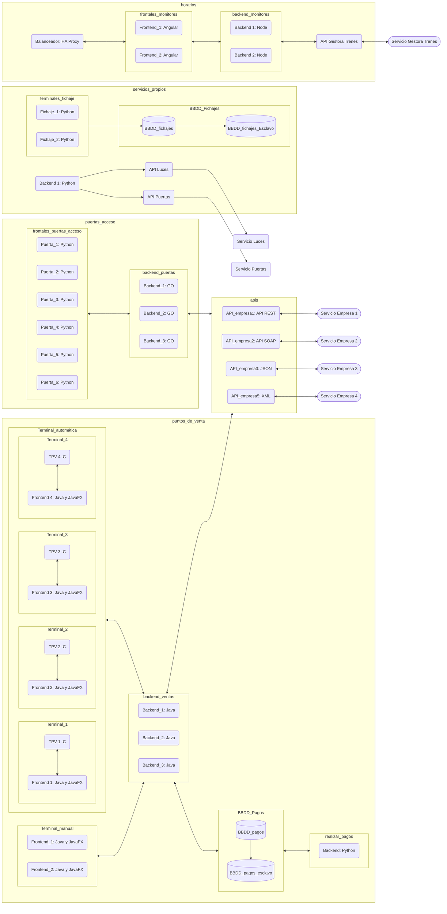

# Estación de Massanasa

_Proyecto de gestión automatica de la infraestructura IT de la estación de Massanasa_

## Comenzando 🚀

_Se nos ha solicitado un proyecto piloto en el que tener un despliegue de todos los sistemas que utiliza la estación_

### Pre-requisitos 📋

```
Docker version 20.10.21
Docker-Compose 1.29.2
```

### Instalación 🔧

_Proceso para poder lanzar en local el despliegue de contenedores_

```
cd gestion_estacion
docker-compose up
```

_Para finalizar los servicios_

```
docker-compose down
```
## Configuración FTP
Usuario y contraseña del servicio FTP:
```
Usuario: user
Contraseña: passpass1234
```

## Autores

* **Guillermo Ruiz** - [gruisonestic](https://github.com/gruizonestic)
* **Guillermo Navio** - [guillermo-navio](https://github.com/guillermo-navio)
* **Jordi Ros** - [jorosmayor](https://github.com/jorosmayor)

## Diagrama

